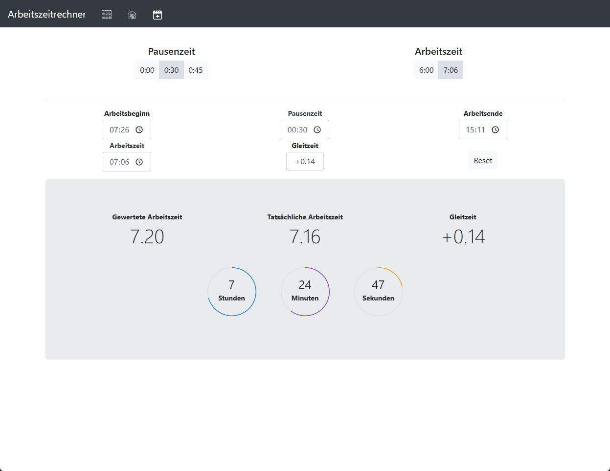

# Arbeitszeitrechner

Eine einfache Anwendung, bei der man den Arbeitsbeginn einträgt und automatisch der Feierabendbeginn ausgerechnet wird.
Die aktuelle Version läuft eigentlich immer stabil, bei der Testversion kann es häufiger zu Fehler kommen, 
davon können neue Features aber schon früher genutzt werden.

Diese Anwendung wurde von einer Anderen inspiriert, aber eigenständig erweitert/verändert.

Ursprünglich wurde das Tool über RawGitHack gehostet, die Links müssten auch immer noch funktionieren, wenn nicht gerne bescheid sagen (Issue erstellen).
Jetzt wird das Tool über Github-Pages gehostet (einfach die Links unten nutzen).


## Links
- ✅ [Aktuelle Version](https://lukasdano.github.io/azr/main/)
- ⚙️ [Testversion](https://lukasdano.github.io/azr/bugfix/)


## Anmerkung

Vorschläge werden gerne entgegenkommen und nach Möglichkeit auch umgesetzt. Hierzu bitte ein Issue erstellen. 

Wer das Tool eigenständig weiter entwickeln möchte, kann das gerne tun. 
Dann aber bitte auf dieses oder das Original verweisen oder einfach Fork erstellen, sodass gleich zu erkennen ist, woher der Code eigentlich kommt.

## SetUp

```
npm install
```

## Benutze Projekte
- [Projektvorlage](https://github.com/iC0RE/arbeitszeitrechner)
- [RawGitHack](https://github.com/neoascetic/rawgithack)
- [Notifications](https://github.com/HoanghoDev/toast)

## Deprecated Links
- [Aktuelle Version](https://raw.githack.com/LukasDano/arbeitszeitrechner/main/index.html)
- [Testversion](https://raw.githack.com/LukasDano/arbeitszeitrechner/bugfix/index.html)
- [v2.5](https://rawcdn.githack.com/LukasDano/arbeitszeitrechner/e4522ef0507b9d33320cf7ff6d02494186b8aa80/index.html)
- [v2.2.02](https://rawcdn.githack.com/LukasDano/arbeitszeitrechner/1c4db626814297964dcc7d3a983e996029d80468/index.html)
- [v2.1.03](https://rawcdn.githack.com/LukasDano/arbeitszeitrechner/d42c883503d5d91299906f788e7a74936b340537/index.html)
- [v1.0](https://rawcdn.githack.com/LukasDano/arbeitszeitrechner/0eb78712aac0fa3f846ca71cf650d0df1f2e7175/index.html)

## Vorschau


